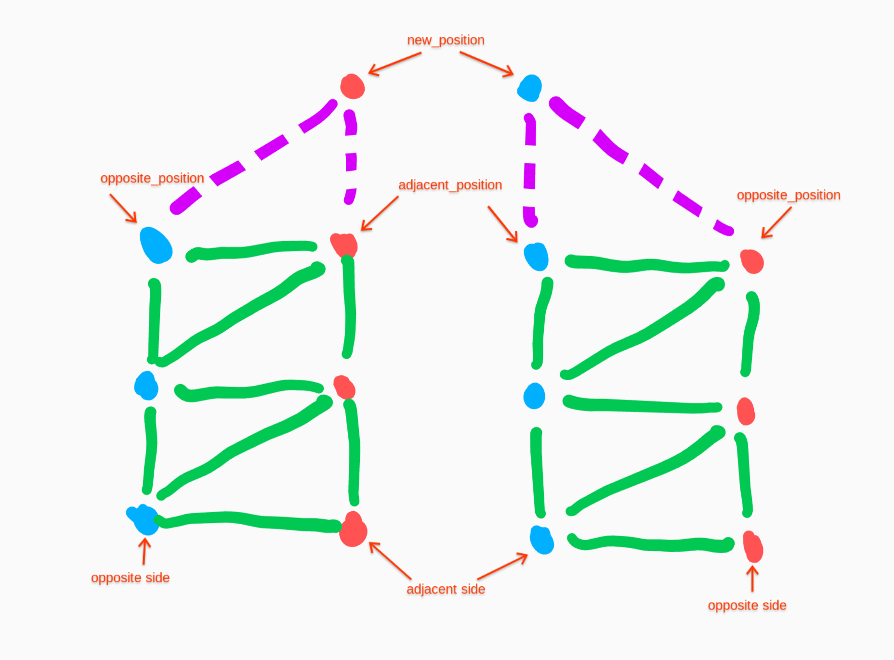
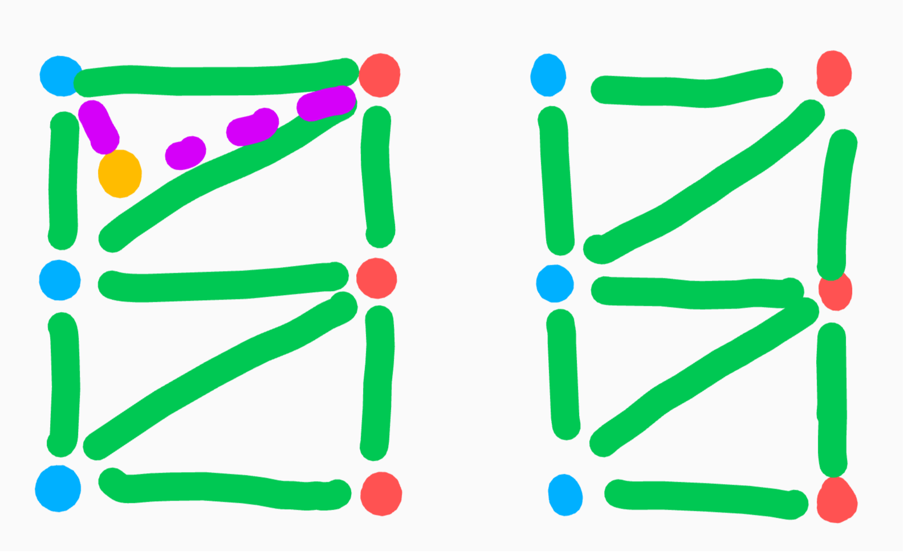
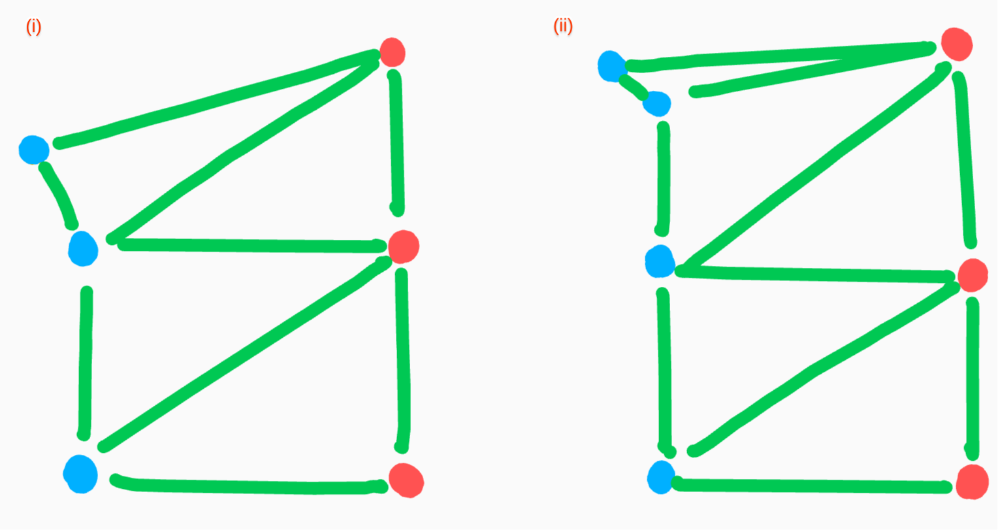
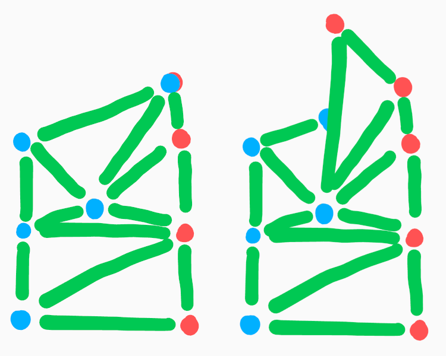
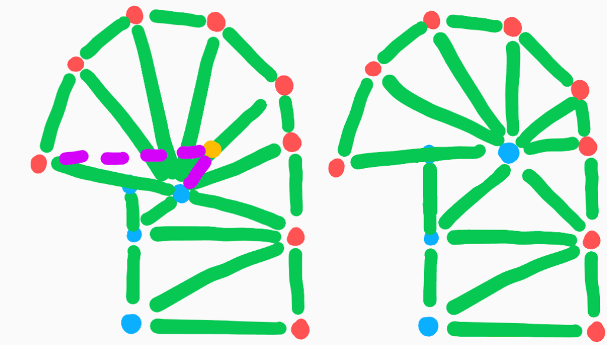
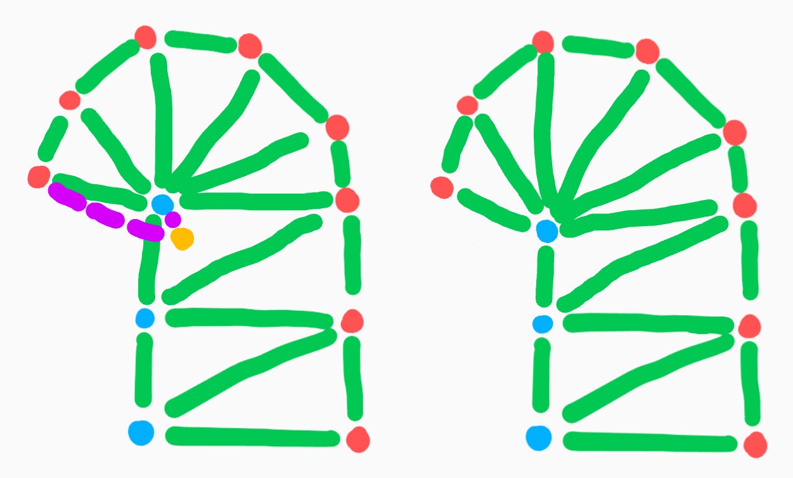
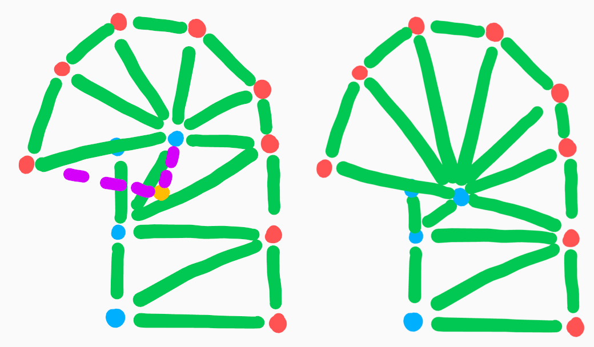
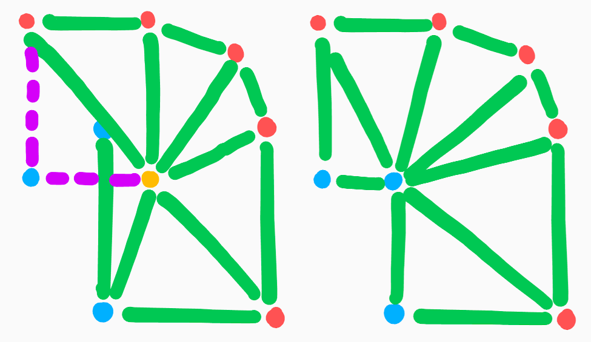
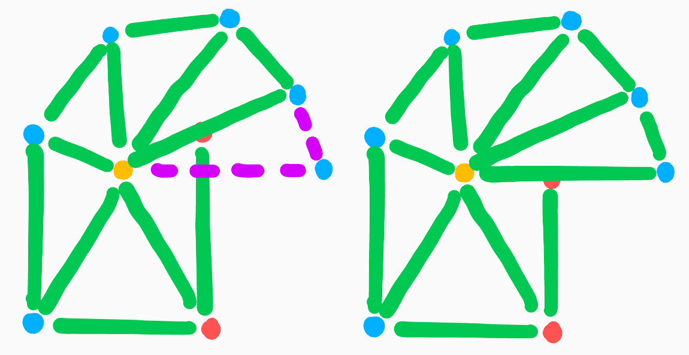

<!-- Copyright 2024 Google LLC

Licensed under the Apache License, Version 2.0 (the "License");
you may not use this file except in compliance with the License.
You may obtain a copy of the License at

     http://www.apache.org/licenses/LICENSE-2.0

Unless required by applicable law or agreed to in writing, software
distributed under the License is distributed on an "AS IS" BASIS,
WITHOUT WARRANTIES OR CONDITIONS OF ANY KIND, either express or implied.
See the License for the specific language governing permissions and
limitations under the License. -->

# Line Mesh Generation

<!-- LINT.IfChange -->

[TOC]

This document details the algorithm used by the
`brush_tip_extruder_internal::Geometry` class to generate the triangulation for
its mesh. Here, we mostly stick to the contents of `Geometry::TriangleBuilder`
found in [geometry.cc](./geometry.cc); and some of the other types in
[ink/strokes/internal/brush_tip_extruder](./).

## Overview

`brush_tip_extruder_internal::Geometry` builds the stroke mesh incrementally by
appending vertices and index triplets to a `MutableMeshView`. The indices come
from the left and right sides of the stroke outline, described by the following
structures (some details omitted):

```c++
// Identifies to which side of the geometry something belongs.
enum class SideId { kLeft, kRight };

// Stores the current state of the left or right side of the stroke as stored in
// the `Geometry` class below.
struct Side {
  struct SelfIntersection {
    // The position after which the intersection began.
    Point starting_position;
    // The last vertex we tried to append in this self-intersection handling.
    ExtrudedVertex last_proposed_vertex;
    // Index of the mesh triangle that contained `last_proposed_vertex`.
    uint32_t last_proposed_vertex_triangle;
    // Offset into `Side::indices` at which to find the index corresponding to
    // the start of this intersection.
    uint32_t starting_offset;
    // True if the intersection has begun modifying previously appended mesh
    // triangles.
    bool retriangulation_started;
    // The newest triangle that should be put into the undo stack. We do not
    // want to put every triangle into the stack, since retriangulation can be
    // delayed.
    uint32_t undo_stack_starting_triangle;
    // Once retriangulation has started, this is the index of the oldest mesh
    // triangle that has been modified.
    uint32_t oldest_retriangulation_triangle;
    // Triangle indices that were written over by retriangulation. Depending on
    // how the intersecting position travels inside the line, some or all of the
    // triangles will be restored. Since retriangulation travels backwards,
    // newest triangles are at the bottom of the stack and oldest are at the
    // top.
    std::vector<std::array<IndexType, 3>> undo_triangulation_stack;
    // The maximum remaining distance that vertices in the outline may be moved
    // while handling this intersection.
    float outline_reposition_budget;
    // The reposition budget when intersection begins. Note that
    // `outline_reposition_budget` will initially become larger than this value
    // when retriangulation starts.
    float initial_outline_reposition_budget;
    // The maximum distance that proposed intersection vertices are allowed to
    // travel from `starting_position`.
    float travel_limit_from_starting_position;
  };

  SideId self_id;
  // Indices into e.g. `MutableMeshView::GetVertex()` for getting the vertices
  // that make up a side of the line. These are ordered from the start of the
  // line to the end.
  std::vector<IndexType> indices;
  // Vertices that need to be processed. Will contain one or two vertices that
  // are already appended to the mesh, because they are needed here for the
  // simplification algorithm.
  std::vector<ExtrudedVertex> vertex_buffer;
  // Index into `vertex_buffer` for the next buffered vertex that should be
  // appended.
  uint32_t next_buffered_vertex_offset = 0;
  std::optional<SelfIntersection> intersection;
};

// Incrementally builds the mesh representing the line out of the passed-in
// vertices.
class Geometry {
 private:
  // Helper class for appending a single triangle to the mesh and handling the
  // different self-intersection cases.
  class TriangleBuilder {
   private:
    // Collection of triangle data used when the slow-path is taken. Here,
    // "adjacent" refers to properties of the `new_index_side_`, and "opposite"
    // is used to refer to the other side.
    struct SlowPathTriangleInfo {
      absl::Nonnull<Side*> adjacent_side;
      absl::Nonnull<Side*> opposite_side;
      Point adjacent_position;
      Point opposite_position;
      ExtrudedVertex proposed_vertex;
      // The index of an existing triangle in `geometry_->mesh_` that contains
      // `proposed_vertex` if one is found.
      std::optional<uint32_t> proposed_vertex_triangle;
    };

    absl::Nonnull<Geometry*> geometry_;
    float initial_outline_reposition_budget_;
    float intersection_travel_limit_;
    float retriangulation_travel_threshold_;
  };

  bool handle_self_intersections_;

  // Mesh data representing the outline of the stroke.
  MutableMeshView mesh_;

  // Identifies which side each vertex in `mesh_` comes from.
  std::vector<SideId> vertex_side_ids_;

  // The left and right sides of the line according to the direction of travel.
  Side left_side_;
  Side right_side_;
};
```

It is the job of `TriangleBuilder::TryAppend()` to vet the incoming vertices and
decide whether to append or reject the proposed vertex and triangle. In the
process, if `Geometry::handle_self_intersections_` is `true`, the function may
modify existing vertices and triangles in the mesh to remove undesirable
overlaps in the geometry.

`TriangleBuilder` is constructed via:

```c++
TriangleBuilder(absl::Nonnull<Geometry*> geometry,
                float initial_outline_reposition_budget,
                float intersection_travel_limit,
                float retriangulation_travel_threshold);
```

`initial_outline_reposition_budget` and `intersection_travel_limit`, are used
when handling self-intersection as a limit for how far vertices may be shifted
or how far the intersection can travel from its starting position. After this
point, the overlap is considered unavoidable and intersection handling is
stopped. The last parameter, `retriangulation_travel_threshold`, is the distance
that self-intersection must travel from its start before we begin
retriangulating the mesh.

We introduce a pair of terms to implement the algorithm in a
left-vs-right-agnostic way. Below, the words *opposite* and *adjacent* are used
to refer to the two sides of the `Line` as they relate to `new_position`. Below
is a labeled diagram of two lines with proposed triangles that have correct
winding order.



## `TriangleBuilder::TryAppend()`

We start by breaking the problem down into eight main cases given by the
combinations of the following criteria:

1.  Does the proposed triangle have counterclockwise winding?
2.  Is the adjacent side currently handling self-intersection?
3.  Is the opposite side currently handling self-intersection?

The eight cases consist of one fast-path that is the expected mode for a line
without sharp turns and seven other cases handling potential intersection. Each
of the seven slow-path cases is handled by a separate function and some are also
further split by a fourth criterion:

*   Is the new vertex inside the existing line?

Next, we outline the logic of each case. The order here is meant to reflect the
chronological order of how cases come up as the line is drawn.

### 1: Fast Path: CCW Triangle, No Ongoing Intersection {#1}

Self-intersections that we wish to remove occur only when the stroke has a turn
radius smaller than the line-width. We do not try to detect and remove
intersections with much older parts of the stroke. The common case is therefore
that self-intersection does not need to be handled at all. In this mode, newly
proposed triangles naturally have the correct winding order.

These conditions are detected by:

*   No value in `left_side_.intersection` and `right_side_.intersection`.
*   The proposed triangle formed by the three iterators has counterclockwise
    winding order.

If they are met, we can append the new vertex and indices and be done.
Otherwise, if `Geometry::handle_self_intersections_` is `false`, we skip
appending the indices to reject the proposed triangle and only append the new
vertex. If `handle_self_intersections_` is `true`, we move on to the cases
below.

### 2: Non-CCW Triangle, No Ongoing Intersection {#2}

The check for counterclockwise winding is our canary for self-intersection. Now
that we have detected a triangle with bad winding, we need to check if the
intersection has actually started by checking if the new vertex is inside the
line.

#### (a) New Vertex is Inside {#2a}

This situation means we have started an adjacent side intersection. We reject
the position of this vertex if the new position has not traveled beyond
`retriangulation_travel_threshold` from the last adjacent position. We do not
add the proposed triangle indices as the triangle would have been non-CCW and
now would be degenerate. Below is a before and after of this case:



If the intersecting position has traveled beyond
`retriangulation_travel_threshold`, then we begin modifying the existing
triangulation of the mesh. This is described below in [case 3a](#3a).

#### (b) New Vertex is Outside {#2b}

There are two situations where this new vertex has been detected to be outside
the current line:


Situation (i) is fairly straightforward: the point is clearly on the exterior
and the triangle does have clockwise winding order. However, situation (ii) may
be surprising at first. Since we allow overlaps with old parts of the stroke,
and we need to make assumptions about the convexity of the submesh involved in
the intersection, the new vertex in (ii) is also detected as on the exterior.
This is because the edge between the new position and the adjacent position does
pass through the exterior of the geometry.

We can detect whether we are dealing with (i) or (ii) by looking for the
intersection between the existing adjacent side and the segment made from the
new position and the opposite position. In (i) such an intersection exists
whereas in (ii) it does not.

Since (ii) is a kind of in-between that is not really exterior and also not
really the start of an intersection, we mitigate by rejecting the new position.
We will allow future vertices to show which action to take.

For (i), the action is a little more complex since we would like to keep the new
position. To prevent poorly winding triangles or overlaps, we shift the adjacent
side backwards to the vertex preceding the intersection. This technically
removes a little existing geometry, but this should still be covered up by the
endcap of the line.

Below is the desired after of the previous diagram.



### 3: Non-CCW Triangle, Adjacent Side Intersection Only {#3}

#### (a) New Vertex is Inside {#3a}

Here, the behavior depends on whether we have already started modifying the
triangulation of the mesh. Retriangulation will not have started if this is just
the second in the sequence of intersecting vertices or if the intersection has
not traveled at least `retriangulation_travel_threshold` away from its start.

If the conditions to retriangulate have not been met, we reject the new vertex
position, as in [case 2a](#2a). This helps limit the amount of retriangulation
when the line is more or less moving in the same direction but has perturbations
because of input quantization.

--------------------------------------------------------------------------------

If retriangulation has not started but we have now traveled beyond
`retriangulation_travel_threshold`, it is time to start modifying existing
triangles. Two new vertices will be appended on the adjacent side to help out
with the retriangulation.


The first newly appended vertex has temporarily been moved to the opposite side.
As extrusion continues to add triangles, it will be pushed back to the adjacent
side by the action of [case 4a](#4a) and [case 5](#5) as in the diagram below.
The second vertex will follow the point of intersection inside the line.



--------------------------------------------------------------------------------

If retriangulation has already begin, we would like for the intersection to
continue traveling inside the line, following the most recent position. However,
if we did this naively when the triangle has non-CCW winding order, we would be
creating a gap in the triangulation.


Therefore, we undo some of the shifting that happens in either [case 4a](#4a) or
[case 5](#5) to fill this gap and instead get:



#### (b) New Vertex is Outside

In this case, we test the proposed triangle winding one more time, but using the
last proposed intersection position instead of the current adjacent position of
the side. These can be differ if retriangulation has not started or the last
proposed vertex was rejected.

If the winding using the last proposed intersection position is
counter-clockwise, we try to finish intersection handling as in [case 4b](#4b)
below. Otherwise, we reject the proposed vertex and wait to choose the
appropriate behavior.

### 4: CCW Triangle, Adjacent Side Intersection Only {#4}

#### (a) New Vertex is Inside {#4a}

With the vertex still inside the line, the initial logic in this branch is much
like [case 3a](#3a). We must decide if retriangulation needs to be started based
on the `retriangulation_travel_threshold`. Where this case differs, is that due
to the triangle being CCW, the opposite side of the triangle will be on the
exterior. This bit of new geometry is valid and we would like to keep it.

If retriangulation should still not be started because new points haven't
traveled far enough, we once again reject the new position. The before and after
looks like the following.



On the other hand, if retriangulation has already started, the self-intersection
vertices follow each new intersection position and are moved to the new
position. Old triangles may get broken up if necessary. The diagram below shows
a before and after.



We only search within the first `SelfIntersection::outline_reposition_budget` of
distance along the outline. If the intersection is not found, that means it
either does not exist at all, or the intersection has traveled too far. In
either case, we pretend that self-intersection has stopped and accept this
degree of overlap. Doing this helps prevent our assumptions about convexity from
breaking down and keeps the triangles from becoming too stretched for the sake
of 2D textures.

#### (b) New Vertex is Outside

As the new vertex is outside of the current line, we need to wrap up handling
self-intersection, resetting the state of `Side::intersection` for the adjacent
side.

As we finish up, we need to modify some existing geometry to cleanly end the
intersection. We must find the intersection between the existing outline and the
segment made from the new vertex position and the last intersection position
found in `SelfIntersection::current_vertex` (the yellow vertex in the diagram
below). The diagram below shows a before and after of this action.



As above, we only search within the first
`SelfIntersection::outline_reposition_budget` of distance along the outline. If
it is not found within this budget, we allow for this bit of overlap to stay.

### 5: CCW Triangle, Opposite Side Intersection Only {#5}

Here, we have almost the same situation as the fast-path case and we can append
the triangle as-is. However, the new triangle may cover some existing geometry
on the opposite side. So we must also move any overlapping vertices out of the
way of the newly added triangle. Below is a diagram showing a before and after
of this case.



As in [case 4a](#4a), we stop the self-intersection on the opposite side if we
have run out of `SelfIntersection::outline_reposition_budget` or failed to find
an intersection with the outline.

### 6: CCW Triangle, Both Sides Intersecting {#6}

This case is a rare combination of [case 4](#4) and [case 5](#5) above.

We always try to perform the main action of [case 5](#5) and move the relevant
vertices of the opposite side out of the way of the proposed new triangle.

When it comes to the actions of [case 4](#4), the only difference is whether we
allow the adjacent side to modify the triangulation of the mesh. When both sides
are handling self-intersection, we only allow one side to modify the
triangulation at a time. The first side that requests to modify triangles has
ownership of this action until intersection handling on that side is complete.
Here, this means that if the opposite side is modifying the triangulation, the
action of [case 4](#4) proceeds as if the new position has not traveled beyond
`retriangulation_travel_threshold`. Otherwise, we can perform the same action as
[case 4](#4) and pretend the opposite side is not undergoing intersection at
all.

### 7: Non-CCW Triangle, Opposite Side Intersection Only {#7}

Here, the situation on the adjacent side is almost the same as [case 2](#2)
where no intersection is occurring on either side.

1.  If the new vertex is inside, we begin an intersection as in [case 2a](#2a).
    If the opposite side has not started retriangulation, we can also begin
    retriangulation on the adjacent side based on
    `retriangulation_travel_threshold`.
2.  Otherwise, if the new vertex is outside and the opposite side has not begun
    retriangulation, we are free to perform the action of [case 2b](#2b).

If neither of these situations hold, we must take care to not disrupt the
retriangulation happening on the opposite side and reject the proposed vertex.

### 8: Non-CCW Triangle, Both Sides Intersecting {#8}

When both sides are handling self-intersection, we make sure that only one of
the sides is able to perform the retriangulation described in [case 3a](#3a).
Whichever side begins retriangulation first is the side that will be able to
continue modifying the mesh's triangles until intersection on that side
finishes.

#### (a) Opposite Side Retriangulation Not Started

If the opposite side has not started retriangulation, that means any opposite
side intersecting vertex positions have been "rejected", likely because they
have not traveled beyond `retriangulation_travel_threshold`. This makes the fact
that the opposite side is undergoing intersection irrelevant for the logic of a
non-CCW triangle on the adjacent side. We can treat this exactly as if it is
[case 3](#3).

The only caveat is that we must recalculate the `last_proposed_vertex_triangle`
for the opposite side since it may have changed after the adjacent side modified
the mesh.

#### (b) Opposite Side Has Started Retriangulation

##### (i) New Vertex is Inside

Since the opposite side has begun retriangulation, we reject the proposed
vertex.

##### (ii) New Vertex is Outside

This subcase is a combination of [case 3b](#3b) for the adjacent side and
[case 3a](#3a) for the opposite side.

As in [case 3b](#3b), we try to finish the intersection on the adjacent side,
only if the triangle winding using the last proposed intersection position is
counter-clockwise.

If we were successful, the leading left-right edge of the stroke has moved
backwards compared with the overal direction of travel. We must therefore
perform the same action as in the end of [case 3a](#3a) for the opposite side,
and extend geometry to meet the new positioning of the leading left-right edge
of the stroke.

<!-- LINT.ThenChange(./geometry.cc)-->
